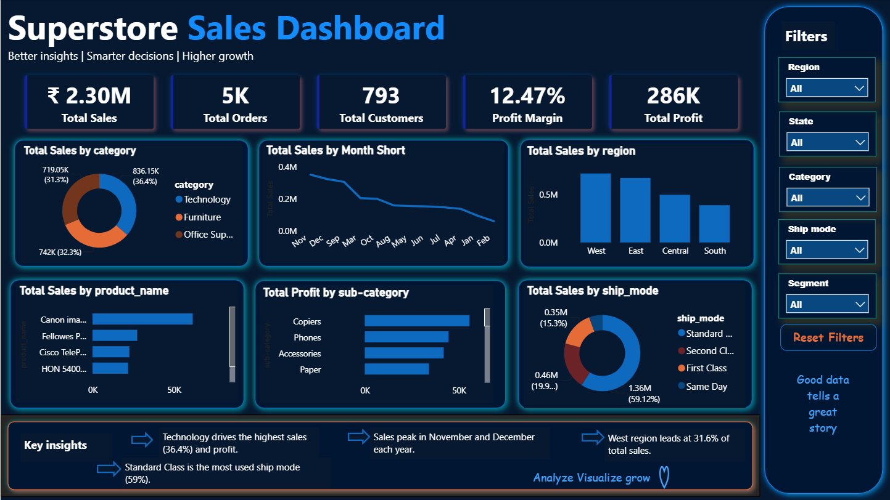

# Retail Sales Analysis

## Overview
This project analyzes retail sales transaction data to uncover performance trends across categories, regions, and customer segments. The workflow covers the full analytics pipeline — data cleaning and exploratory analysis in Python, business-question querying in SQL Server, and an interactive Power BI dashboard — concluding with a written report and a Gamma presentation summarizing key findings for a non-technical audience.

## Dataset
- **Dataset:** Retail Sales / Superstore Dataset
- **Description:** Order-level retail transaction data including product category, sub-category, sales, profit, discount, region, state, customer segment, and ship mode.

**Key columns used:**
- `Order Date` — Date of the transaction
- `Category`, `Sub-Category` — Product classification
- `Sales`, `Profit`, `Discount` — Core financial metrics
- `Region`, `State` — Geographic breakdown
- `Segment`, `Ship Mode` — Customer and fulfillment attributes

## Tools
- **Python** (Pandas, Matplotlib, Seaborn) — data cleaning and exploratory data analysis
- **SQL Server** — business-question-driven querying on the cleaned dataset
- **Power BI** — interactive dashboard for sales performance exploration
- **Gamma** — presentation deck summarizing the project for a non-technical audience

## Steps
1. **Data Cleaning (Python)** — Loaded the raw dataset, handled missing values, corrected data types, and removed inconsistent records to prepare a clean dataset for analysis.
2. **Exploratory Data Analysis (Python)** — Analyzed sales and profit trends across categories, regions, and time periods, and examined the relationship between discount levels and profitability.
3. **SQL Analysis** — Loaded the cleaned dataset into SQL Server and answered 12 business questions covering sales and profit by category, region, sub-category, customer segment, and time trend.
4. **Dashboard (Power BI)** — Built an interactive dashboard with 5 KPI cards and charts for category, region, ship-mode, and sales-trend analysis, with slicers for Region, State, Category, Ship Mode, and Segment.
5. **Reporting** — Compiled all SQL findings, the dashboard, and key insights into a written report.
6. **Presentation** — Summarized the project objective, methodology, and key findings into a Gamma presentation for stakeholder-facing delivery.

## Dashboard
The Power BI dashboard includes:
- 5 KPI cards summarizing overall sales performance
- Sales and profit breakdown by category and sub-category
- Region-wise and ship-mode-wise performance charts
- A sales trend view over time
- Slicers for Region, State, Category, Ship Mode, and Segment for dynamic filtering

## 📊 Project Preview



## Results
- Sales and profit performance vary significantly across product categories, with some categories generating high sales but disproportionately low (or negative) profit.
- Certain regions consistently outperform others in both sales volume and profitability, highlighting where business investment is most effective.
- Higher discount levels are associated with reduced profit margins, with very high discounts occasionally resulting in a net loss on orders.
- Ship mode and customer segment both show measurable differences in order volume and profitability, useful for operational and marketing prioritization.

**Recommendation:** Focus promotional and inventory investment on high-performing categories and regions, while reviewing discount policies on low-margin sub-categories to protect overall profitability.

## How to Run
1. Clone this repository
2. **Python:** Install required libraries and run the notebook
   ```
   pip install pandas numpy matplotlib seaborn
   ```
3. **SQL:** Import the cleaned CSV into SQL Server, then run the queries in `/sql`
4. **Power BI:** Open the `.pbix` file in `/powerbi` with Power BI Desktop
5. **Report & Presentation:** Find the written report and Gamma presentation link under `/reports`
